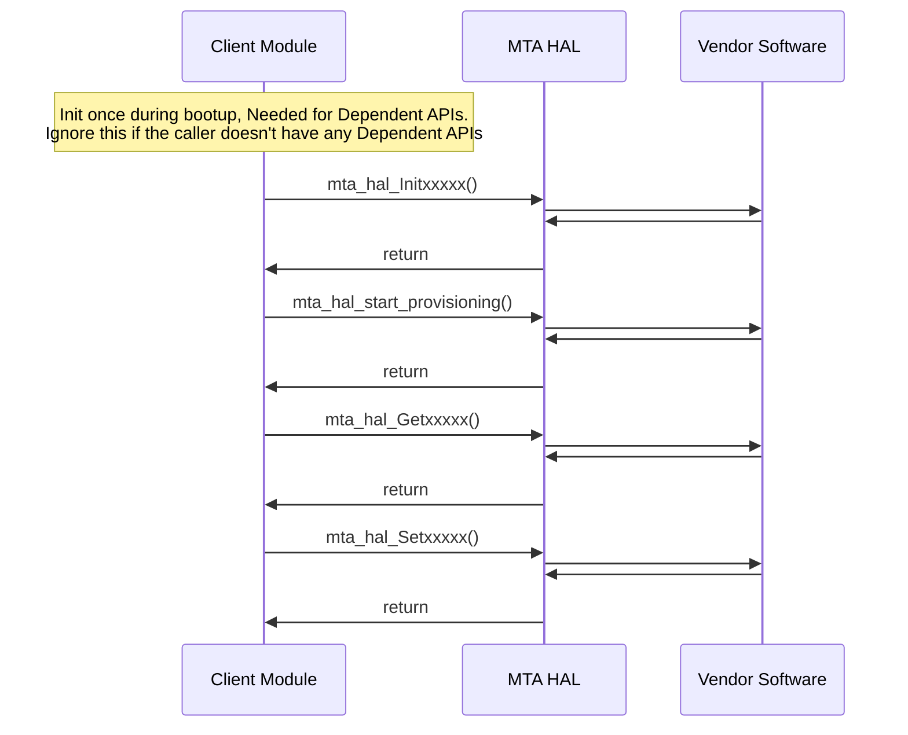

# MTA HAL Documentation

## Acronyms

- `MTA` \- Media Terminal Adapter
- `DECT` \- Digital Enhanced Cordless Telecommunications
- `HAL` \- Hardware Abstraction Layer
- `RDK-B` \- Reference Design Kit for Broadband Devices
- `OEM` \- Original Equipment Manufacture
- `DSX` \- Digital Signal Cross-connect
- `TN` \- Telephone Number
- `DHCP` \- Dynamic Host Configuration Protocol
- `DHCPv6` \- Dynamic Host Configuration Protocol for IPv6

## Description

The diagram below describes a high-level software architecture of the MTA(Media Terminal Adapter) HAL module stack.

MTA HAL is an abstraction layer implemented to abstract the underlying MTA hardware and interacts with the underlying voice vendor software through a standard set of APIs. An MTA can deliver Home Phone service in addition to High speed internet.

## Component Runtime Execution Requirements

### Initialization and Startup

The below-mentioned APIs initialize the MTA HAL layers/code. The MTA client module should call the mentioned APIs initially during bootup/initialization.

- `mta_hal_InitDB()`
- `mta_hal_start_provisioning()`

3rd party vendors will implement appropriately to meet operational requirements. This interface is expected to be blocked if the hardware is not ready.

## Threading Model

The interface is not thread-safe.

Any module that is invoking the MTA HAL API should ensure calls are made in a thread-safe manner.

Vendors can create internal threads/events to meet their operation requirements. These should be responsible for synchronizing between the calls, and events and cleaning up on closure.

## Process Model

All APIs are expected to be called from multiple processes.

## Memory Model

The client is responsible to allocate and deallocate memory for necessary APIs as specified in API Documentation.
Different 3rd party vendors are allowed to allocate memory for internal operational requirements. In this case, 3rd party implementations should be responsible to de-allocate internally.

TODO: State a footprint requirement. Example: This should not exceed XXXX KB.

## Power Management Requirements

The HAL is not involved in any of the power management operations.
Any power management state transitions MUST not affect the operation of the HAL.

## Asynchronous Notification Model

There are no asynchronous notifications.

## Blocking calls

The APIs are expected to work synchronously and should be completed within a time commensurate with the complexity of the operation and by any relevant MTA specification. Any procedures that risk failure due to unresponsive connected devices should adhere to a timeout period. This timeout should be based on standard specifications or as stated in the corresponding API documentation, to maintain optimal lower interface operations.

TODO: Moving forward, we plan to specify the time limit within which tasks should be completed. This will involve fetching relevant information as needed, and we aim to clearly define this time-related expectation to avoid confusion in the future.

## Internal Error Handling

All HAL APIs are designed to return all errors synchronously as part of their return arguments. The responsibility to manage system errors such as memory shortages and errors must be returned so the caller can take appropriate action.

## Persistence Model

There is no requirement for HAL to persist any setting information. The caller is responsible for persisting any settings related to the MTA feature.

## Nonfunctional requirements

The following non-functional requirements should be supported by the component.

## Logging and debugging requirements

MTA HAL component should log all the errors and critical informative messages, preferably using printf, and syslog which helps to debug/triage the issues and understand the functional flow of the system.

The logging should be consistent across all HAL components.

If the vendor is going to log then they have to be logged in the `mta_vendor_hal.log` file name which can be placed in `/rdklogs/logs/` or `/var/tmp/` directory.

Logging should be defined with log levels as per Linux standard logging.

## Memory and performance requirements

The component should not be contributing more to memory and CPU utilization while performing normal operations and commensurate with the operation required.

## Quality Control

MTA HAL implementation should pass checks using any third-party tools like `Coverity`, `Black Duck`, `Valgrind` etc. without any issues to ensure quality.

There should not be any memory leaks/corruption introduced by HAL and underneath 3rd party software implementation.

## Licensing

MTA HAL implementation is expected to be released under the Apache License 2.0.

## Build Requirements

The source code should be able to be built under a Linux Yocto environment and should be delivered as a shared library named `libhal_mta.so`

## Variability Management

Changes to the interface will be controlled by versioning, vendors will be expected to implement a fixed version of the interface, and based on SLA agreements move to later versions as demand requires.

Each API interface will be versioned using [Semantic Versioning 2.0.0](https://semver.org/), and the vendor code will comply with a specific version of the interface.

## Platform or Product Customization

None

## Interface API Documentation

All HAL function prototypes and datatype definitions are available in the `mta_hal.h` file.
  1.  Components/Processes must include `mta_hal.h` to make use of MTA HAL capabilities
  2.  Components/Processes must include linker dependency for `libhal_mta.so`.

## Theory of operation and key concepts

Covered as per "Description" sections in the API documentation.

## Sequence Diagram

