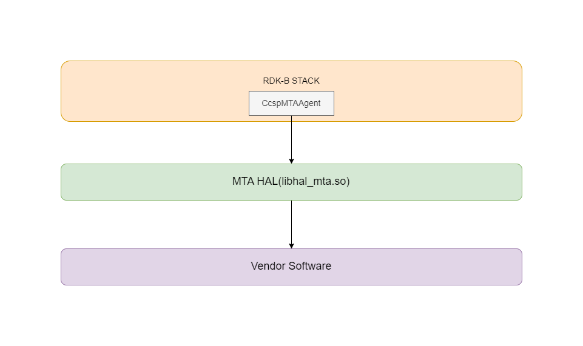

# MTA HAL Documentation

## Acronyms

- `HAL` \- Hardware Abstraction Layer
- `RDK-B` \- Reference Design Kit for Broadband Devices
- `OEM` \- Original Equipment Manufacture

## Description
The diagram below describes a high-level software architecture of the MTA HAL module stack.

MTA HAL is an abstraction layer implemented to abstract the underlying MTA hardware and interact with the underlying voice vendor software through a standard set of APIs. An MTA can deliver Home Phone service in addition to High speed internet.

## Component Runtime Execution Requirements

### Initialization and Startup

The below mentioned APIs initialize the MTA HAL layers/code. MTA client module should call the mentioned APIs initially during bootup/initialization.

- `mta_hal_InitDB()`
- `mta_hal_start_provisioning()`

3rd party vendors will implement appropriately to meet operational requirements. This interface is expected to block if the hardware is not ready.

## Threading Model

The interface is not thread safe.

Any module which is invoking the MTA HAL API should ensure calls are made in a thread safe manner.

Different 3rd party vendors allowed to create internal threads to  meet the operational requirements. In this case 3rd party implementations should be responsible to synchronize between the calls, events and cleanup the thread.

## Process Model

All API's are expected to be called from multiple process.

## Memory Model

The client is responsible to allocate and deallocate memory for necessary APIs as specified in API Documentation.
Different 3rd party vendors allowed to allocate memory for internal operational requirements. In this case 3rd party implementations should be responsible to de-allocate internally.

## Power Management Requirements

The HAL is not involved in any of the power management operation.
Any power management state transitions MUST not affect the operation of the HAL.

## Asynchronous Notification Model

There are no asynchronous notifications.

## Blocking calls

The APIs are expected to work synchronously and should complete within a time period commensurate with the complexity of the operation and in accordance with any relevant MTA specification. The APIs should probably just send a message to a driver event handler task.
Any calls that can fail due to the lack of a response from connected device should have a timeout period in accordance with any API documentation.

## Internal Error Handling

All the MTA HAL APIs should return error synchronously as a return argument. HAL is responsible to handle system errors(e.g. out of memory) internally.

## Persistence Model

There is no requirement for HAL to persist any setting information. The caller is responsible to persist any settings related to MTA feature.

## Nonfunctional requirements

Following non functional requirement should be supported by the component.

## Logging and debugging requirements

MTA HAL component should log all the error and critical informative messages which helps to debug/triage the issues and understand the functional flow of the system.

The logging should be consistence across all HAL components.

If the vendor is going to log then it has to be logged in `xxx_vendor_hal.log` file name.

Logging should be defined with log levels as per Linux standard logging.

## Memory and performance requirements

The component should not contributing more to memory and CPU utilization while performing normal operations and commensurate with the operation required.

## Quality Control

MTA HAL implementation should pass `Coverity`, `Black duck`, `Valgrind` checks without any issue.

There should not be any memory leaks/corruption introduced by HAL and underneath 3rd party software implementation.

## Licensing

MTA HAL implementation is expected to released under the Apache License 2.0.

## Build Requirements

The source code should be build under Linux Yocto environment and should be delivered as a shared library named as `libhal_mta.so`

## Variability Management

Any new API introduced should be implemented by all the 3rd party module and RDK generic code should be compatible with specific version of HAL software

Each API interface will be versioned using [Semantic Versioning 2.0.0](https://semver.org/), the vendor code will comply with a specific version of the interface.

## Platform or Product Customization

None

# Interface API Documentation

All HAL function prototypes and datatype definitions are available in `mta_hal.h` file.
  1.  Components/Processes must include `mta_hal.h` to make use of MTA HAL capabilities
  2.  Components/Processes must include linker dependency for `libhal_mta.so`.

## Theory of operation and key concepts

Covered as per "Description" sections in the API documentation.

### UML Diagrams

## Sequence Diagram

